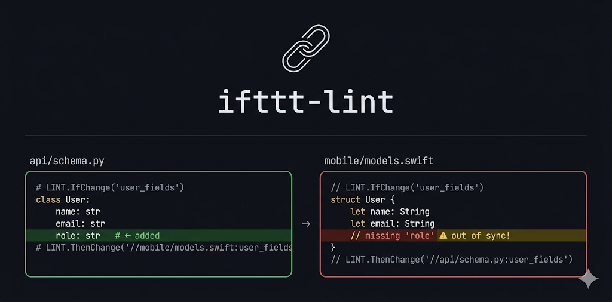

<p align="center">
  <a href="https://github.com/simonepri/ifttt-lint"></a>
</p>
<p align="center">
</p>
<p align="center">
  <strong>Stop cross-file drift with Google's <code>IfChange</code> / <code>ThenChange</code> comments.</strong>
  <br/>
  <sub>
    Open-source reimplementation of <a href="https://www.chromium.org/chromium-os/developer-library/guides/development/keep-files-in-sync/">Google's internal IfThisThenThat linter</a>.
  </sub>
</p>
<p align="center">
  <a href="https://crates.io/crates/ifttt-lint"></a>
  <a href="LICENSE"></a>
</p>

## The Problem

You add a field to a Go struct and forget the TypeScript mirror. You bump a constant and forget the docs. You rename a database column and forget the migration. You only discover it when something breaks in production — or worse, when a user reports it weeks later.

`ifttt-lint` is built to catch exactly that. You wrap co-dependent sections in `LINT.IfChange` / `LINT.ThenChange` comment directives. When a diff touches one side but not the other, the tool fails — before the change reaches production. The model is intentionally simple, which keeps it predictable.

This repo dogfoods its own directives to keep the tool version in sync across [`Cargo.toml`](Cargo.toml), the [pre-commit config](#pre-commit-recommended), and the [CI release pipeline](.github/workflows/ci-cd.yml). Automation ([release-plz](https://github.com/release-plz/release-plz)) does the normal sync; the directives catch the case where someone edits one of those places manually and bypasses the release flow.

## Setup

### GitHub Actions

<!-- LINT.IfChange(version-github-action) -->

```yaml
on:
  push:
    branches: [main]
  pull_request:

jobs:
  ifttt-lint:
    runs-on: ubuntu-latest
    steps:
      - uses: actions/checkout@v4
      - uses: simonepri/ifttt-lint@v0.10.1
```

<!-- LINT.ThenChange(//Cargo.toml:version, //.github/workflows/ci-cd.yml:version) -->

The action mirrors the two hooks:

- **`pull_request`** — diff validation equivalent to `ifttt-lint-diff`. Validates co-changes across all commits in the PR. Supports `NO_IFTTT` suppression via commit messages.
- **`push`** — structural validation on all tracked files, equivalent to `ifttt-lint '**/*'`. Use `on.push.branches` to control which branches run it.

### pre-commit (recommended)

<!-- LINT.IfChange(version-pre-commit) -->

```yaml
- repo: https://github.com/simonepri/ifttt-lint
  rev: v0.10.1
  hooks:
    - id: ifttt-lint
    - id: ifttt-lint-diff
```

<!-- LINT.ThenChange(//Cargo.toml:version, //.github/workflows/ci-cd.yml:version) -->

Two hooks serve different purposes:

- **`ifttt-lint`** — runs at every commit on the staged files. Checks that all `ThenChange` targets and labels exist on disk, directives are properly paired, and syntax is valid. Also supports `pre-commit run --all-files` for full-repo structural scans.

- **`ifttt-lint-diff`** — runs at every push on all files in the diff range. Checks that co-dependent files are updated together. Supports `NO_IFTTT` suppression via commit messages. Mirrors the `pull_request` GitHub Actions check in intent: diff-based validation with the same suppression mechanism, though the exact git range differs by context.

### Install the CLI manually

If you prefer running `ifttt-lint` directly, install it with Cargo:

```bash
cargo install ifttt-lint
```

See the [CLI reference](#cli-reference) below for invocation patterns and flags.

### Using with coding agents

Guidance for `AGENTS.md` sits on top of any of the install paths above — it doesn't replace them. If you use coding agents (Codex, Claude Code, etc.), consider adding something like this to your `AGENTS.md` so agents create directives proactively and keep them narrow:

````markdown
#### Co-dependent changes: use IFTTT directives

When code in one place must stay in sync with code elsewhere — but DRY cannot eliminate the duplication (for example, cross-language boundaries, config mirroring code, or encode/decode pairs) — mark the dependency with `LINT.IfChange` / `LINT.ThenChange` directives so changes to one side prompt review of the other. Add these directives proactively when creating new co-dependent content, not just when maintaining existing pairs.

Keep the guarded block as small as possible. Prefer several small labeled source->target pairs over one large catch-all block unless the whole region genuinely needs to change together. The directives can be validated and enforced via [ifttt-lint](https://github.com/simonepri/ifttt-lint/blob/main/readme.md).

<details>
<summary>Example</summary>

```javascript
// LINT.IfChange(speed_threshold)
SPEED_THRESHOLD_MPH = 88;
// LINT.ThenChange(
//     //db/migrations/temporal_displacement.sql,
//     //docs/delorean.md:speed_threshold,
// )
```

</details>
````

## Usage

Add directives as comments in any supported language — the tool auto-detects comment styles based on file extension.

### Keep code and docs in sync

Your upload limit is defined in code and referenced in the API docs. Label both sides and link them — if one changes, the other must too:

<table>
<tr>
<th><code>config/upload.py</code></th>
<th><code>docs/api.md</code></th>
</tr>
<tr>
<td>

```python
# LINT.IfChange(upload_limit)
MAX_UPLOAD_SIZE_MB = 50
# LINT.ThenChange(//docs/api.md:upload_limit)
```

</td>
<td>

<!-- prettier-ignore -->
```markdown
<!-- LINT.IfChange(upload_limit) -->
Files up to 50 MB are accepted.
<!-- LINT.ThenChange(//config/upload.py:upload_limit) -->
```

</td>
</tr>
</table>

Bump the limit to 100 MB but forget the docs? The linter catches it:

```
config/upload.py:1: warning: changes in this block may need to be reflected in docs/api.md:upload_limit
```

### Sync across language boundaries

When types cross language boundaries, a shared schema language (Protocol Buffers, Thrift, GraphQL) is the best solution. But not every project uses one — and even when it does, hand-written types often exist alongside generated ones. For those cases, link the two sides directly:

<table>
<tr>
<th><code>api/types.go</code></th>
<th><code>web/src/types.ts</code></th>
</tr>
<tr>
<td>

```go
// LINT.IfChange(user_response)
type UserResponse struct {
    ID    string `json:"id"`
    Name  string `json:"name"`
    Email string `json:"email"`
}
// LINT.ThenChange(//web/src/types.ts:user_response)
```

</td>
<td>

```typescript
// LINT.IfChange(user_response)
interface UserResponse {
  id: string;
  name: string;
  email: string;
}
// LINT.ThenChange(//api/types.go:user_response)
```

</td>
</tr>
</table>

### Link multiple targets

A rate limit touches the database, the docs, and an alerting threshold in the same file. List all dependents — the tool checks every target:

```python
# LINT.IfChange
RATE_LIMIT_RPS = 100
# LINT.ThenChange(
#     //db/migrations/002_rate_limits.sql,
#     //docs/api.md:rate_limits,
#     :alert_threshold,
# )
```

### Sync within a file

Serialize and deserialize must stay in lockstep — use `:label` to reference another section in the same file:

```python
# LINT.IfChange(serialize_event)
def serialize_event(event: Event) -> bytes: ...
# LINT.ThenChange(:deserialize_event)

# LINT.IfChange(deserialize_event)
def deserialize_event(data: bytes) -> Event: ...
# LINT.ThenChange(:serialize_event)
```

## Reference

### Directive syntax

`ifttt-lint` implements [Google's `LINT.IfChange` / `LINT.ThenChange` directive syntax](https://www.chromium.org/chromium-os/developer-library/guides/development/keep-files-in-sync/)<sup>†</sup>.

| Directive                       | Description                                                     |
| ------------------------------- | --------------------------------------------------------------- |
| `LINT.IfChange`                 | Marks the start of a watched region                             |
| `LINT.IfChange(label)`          | Watched region with a named label (targetable from other files) |
| `LINT.ThenChange(//path)`       | End of watched region; requires target file to be modified      |
| `LINT.ThenChange(//path:label)` | Requires changes within a specific label range in the target    |
| `LINT.ThenChange(:label)`       | Same-file label reference                                       |
| `LINT.ThenChange(//a, //b)`     | Multiple targets (comma-separated)                              |

<sub>† `ifttt-lint` enforces [stricter path rules](#path-rules) than Google's internal linter by default — use `--strict=false` for Google-compatible behavior.</sub>

#### Path rules

- All file paths must start with `//` (project-root-relative)
- `:` separates file path from label (splits on last `:`) — Windows drive-letter colons (e.g. `C:\`) are not treated as label separators
- `:label` alone means same-file reference

Use `--strict=false` for Google-compatible behavior — bare paths (`path/to/file`), single-`/` paths (`/path/to/file`), and explicit same-file path references (`//same-file.h:label` instead of `:label`) are all accepted without warnings.

#### Label format

Labels must start with a letter, followed by letters, digits, underscores, dashes, or dots. For example: `upload_limit`, `user-response`, `section2`, `Payments.Pix.Result`.

#### Exact matching

Directives must appear alone on their comment line — no extra text before or after the directive pattern. If a comment contains a directive-like pattern with trailing text (e.g. `// LINT.IfChange(label) see docs` or `// LINT.ThenChange(//path) -->`), it is silently ignored as prose. This avoids false positives from documentation or comments that mention directive syntax without intending to create a directive.

#### Nesting

Nesting `IfChange` blocks is not supported — each `IfChange` must be closed by a `ThenChange` before another can begin. A consecutive `IfChange` without an intervening `ThenChange` is reported as an error. Nesting could be added (stack-based pairing) but lacks a clear use case: any nested scenario decomposes into sequential blocks with [multiple targets](#link-multiple-targets).

#### Comment syntax

Directives use the supported comment syntax for each file extension — `//`, `#`, `<!-- -->`, `--`, `;`, `%`, and `/* */` all work depending on the language. See [supported languages](#supported-languages) for the full registry.

```sql
-- LINT.IfChange(schema)
CREATE TABLE users (id UUID, name TEXT, email TEXT);
-- LINT.ThenChange(//api/types.go:user_response)
```

```yaml
# LINT.IfChange(deploy_config)
replicas: 3
# LINT.ThenChange(//docs/runbook.md:scaling)
```

#### Fenced code blocks

Directives inside fenced Markdown code blocks (` ``` `) are ignored — the linter won't fire on examples in documentation. This README itself contains dozens of `LINT.IfChange` examples and passes `ifttt-lint` cleanly. The same applies to code blocks inside doc comments (Rust `///`, Python docstrings with embedded examples).

### CLI reference

```
ifttt-lint [OPTIONS] [FILES]...
```

| Argument   | Description                                                                                                                                                                                                                                                                                                                                    |
| ---------- | ---------------------------------------------------------------------------------------------------------------------------------------------------------------------------------------------------------------------------------------------------------------------------------------------------------------------------------------------- |
| `FILES...` | Files to validate structurally: checks that every `ThenChange` target and label exists on disk, regardless of whether the file was modified. Supports glob patterns resolved internally via `git ls-files` to avoid shell `ARG_MAX` limits. `*` matches within a single directory level; use `**/*` for recursive matching (e.g. `'**/*.rs'`). |

| Option                   | Description                                                                                                                                      |
| ------------------------ | ------------------------------------------------------------------------------------------------------------------------------------------------ |
| `-d, --diff <RANGE>`     | Git ref range to diff (e.g. `main...HEAD`)                                                                                                       |
| `-t, --threads <N>`      | Worker thread count (default: 2; 0 = same as 2)                                                                                                  |
| `-i, --ignore <PATTERN>` | Permanently ignore target pattern, repeatable (glob syntax)                                                                                      |
| `--strict=false`         | Accept bare and single-`/` paths in `ThenChange` targets (in addition to `//`). Required for codebases that use Google-internal path conventions |
| `-f, --format <FMT>`     | Output format: `pretty` (default), `json`, `plain`                                                                                               |

| Exit Code | Meaning                             |
| --------- | ----------------------------------- |
| `0`       | No errors                           |
| `1`       | Lint errors found                   |
| `2`       | Fatal error (bad diff, I/O failure) |

### Validation

`ifttt-lint` runs up to three validation passes depending on how it's invoked. The default `pretty` output format uses standard `file:line: severity: message` syntax, compatible with most editors and CI systems.

#### CLI modes

| Invocation                         | Hook stage   | What runs                                                                                                                        |
| ---------------------------------- | ------------ | -------------------------------------------------------------------------------------------------------------------------------- |
| `ifttt-lint` (no args)             | —            | Nothing — exits 0 with a hint                                                                                                    |
| `ifttt-lint FILES…` (no `--diff`)  | `pre-commit` | Structural validation on listed files only                                                                                       |
| `ifttt-lint '**/*'` (no `--diff`)  | CI, manual   | Structural validation on all tracked files (glob expanded via `git ls-files`)                                                    |
| `ifttt-lint --diff REF FILES…`     | —            | Structural validation on listed files. Diff validation scoped to listed files. Reverse lookup for deleted files and stale labels |
| `ifttt-lint --diff REF` (no files) | `pre-push`   | Structural + diff validation on all files in the diff. Reverse lookup for deleted files and stale labels                         |

#### Diff-based validation

When an `IfChange`…`ThenChange` block is present in a changed file, the tool checks whether the **guarded content** (lines between the directives) was modified. If it was, every `ThenChange` target must also show changes in the same diff — otherwise a finding is reported.

Changes to the directive lines themselves (adding a new pair, renaming a label, adding or removing a `ThenChange` target) do **not** trigger validation — only content between the directives matters. The tool does not try to infer semantic code moves; it validates the file, label, and path coordinates visible in the diff.

**Fires:**

A field is added to the Go struct but the TypeScript mirror is not updated:

```diff
  // LINT.IfChange(user_response)
  type UserResponse struct {
      ID    string `json:"id"`
      Name  string `json:"name"`
+     Avatar string `json:"avatar"`
  }
  // LINT.ThenChange(//web/src/types.ts:user_response)
```

```
api/types.go:1: warning: changes in this block may need to be reflected in web/src/types.ts:user_response
```

Content is modified and a new target is added in the same diff — all targets (including the new one) must reflect the change, because you're declaring a dependency while simultaneously changing the content it guards:

```diff
  // LINT.IfChange(upload_limit)
- MAX_UPLOAD_SIZE_MB = 50
+ MAX_UPLOAD_SIZE_MB = 100
- // LINT.ThenChange(//docs/api.md:upload_limit)
+ // LINT.ThenChange(
+ //     //docs/api.md:upload_limit,
+ //     //alerts/thresholds.yaml:upload_limit,
+ // )
```

```
config/upload.py:1: warning: changes in this block may need to be reflected in docs/api.md:upload_limit
config/upload.py:1: warning: changes in this block may need to be reflected in alerts/thresholds.yaml:upload_limit
```

**Does not fire:**

Adding a new directive pair around existing code — the directive is being established, not the content changed:

```diff
+ // LINT.IfChange(speed_threshold)
  SPEED_THRESHOLD_MPH = 88
+ // LINT.ThenChange(//docs/delorean.md:speed_threshold)
```

Adding a new target to an existing directive — directive metadata changed, not guarded content:

```diff
  // LINT.IfChange(rate_limit)
  RATE_LIMIT_RPS = 100
- // LINT.ThenChange(//docs/api.md:rate_limits)
+ // LINT.ThenChange(
+ //     //docs/api.md:rate_limits,
+ //     //alerts/thresholds.yaml:rate_limits,
+ // )
```

Renaming a label — directive metadata changed; stale references are caught by the reverse lookup instead:

```diff
- // LINT.IfChange(old_name)
+ // LINT.IfChange(new_name)
  SPEED_THRESHOLD_MPH = 88
  // LINT.ThenChange(//docs/delorean.md:speed_threshold)
```

Label renamed _and_ content changed in the same commit — a known edge case. The tool sees this as a full delete + add (the whole `IfChange(old_name)` block disappears, a new `IfChange(new_name)` block appears), so the content change is not flagged for diff-based validation:

```diff
- // LINT.IfChange(old_name)
- MAX_UPLOAD_SIZE_MB = 50
+ // LINT.IfChange(new_name)
+ MAX_UPLOAD_SIZE_MB = 100
  // LINT.ThenChange(//docs/api.md:upload_limit)
```

If you need both a rename and a content change, split them across two commits so the second one triggers the sync check. Stale references to the old label are still caught by reverse lookup in the meantime.

Both sides updated in the same diff — the target already reflects the change:

```diff
  // LINT.IfChange(upload_limit)
- MAX_UPLOAD_SIZE_MB = 50
+ MAX_UPLOAD_SIZE_MB = 100
  // LINT.ThenChange(//docs/api.md:upload_limit)
```

```diff
  <!-- LINT.IfChange(upload_limit) -->
- Files up to 50 MB are accepted.
+ Files up to 100 MB are accepted.
  <!-- LINT.ThenChange(//config/upload.py:upload_limit) -->
```

Suppressed via `NO_IFTTT` in the commit message — explicitly opted out (see [Suppression](#suppression) below).

#### Structural validation

When files are passed as positional arguments (`FILES…`), the tool checks directive structure regardless of the diff. This catches issues that diff-based validation can't see — broken references, missing targets, malformed syntax.

| Check                                  | Example message                               |
| -------------------------------------- | --------------------------------------------- |
| ThenChange target file doesn't exist   | `target file not found: web/src/old_types.ts` |
| ThenChange label not found in target   | `label upload_limit not found in docs/api.md` |
| IfChange without matching ThenChange   | `LINT.IfChange without matching ThenChange`   |
| ThenChange without preceding IfChange  | `LINT.ThenChange without preceding IfChange`  |
| Duplicate IfChange labels in same file | `duplicate LINT.IfChange label foo`           |

#### Reverse lookup

Reverse lookup covers stale references that diff-based validation cannot see:

- When a target file is **deleted or renamed**, surviving `ThenChange(//old/path)` references are reported as stale old paths.
- When a file is **modified** and an `IfChange` label disappears from that file's current contents, surviving `ThenChange(//path:old_label)` references are reported as stale old labels. This includes label renames, removals, and moving the labeled block elsewhere, but it is still based on the old file+label coordinate rather than semantic move tracking.

```
api/types.go:7: warning: target file not found: web/src/old_types.ts
config/upload.py:3: warning: label old_name not found in constants.py
```

Reverse lookup always runs globally — it is not scoped by the file list.

#### Suppression

When you intentionally skip diff-based `ThenChange` checks for a commit, add `NO_IFTTT=<reason>` to the commit message:

```
feat: raise upload limit to 100 MB

NO_IFTTT=docs will be updated in a follow-up
```

`NO_IFTTT=<reason>` in any commit message in the scanned range suppresses diff-based validation for the entire range. Structural validation and deleted-file reverse lookup always run regardless of `NO_IFTTT`. The tag has no effect without `--diff`.

**Scope** — each context scans exactly one range:

| Context                            | Diff range                                    | Commit messages scanned                |
| ---------------------------------- | --------------------------------------------- | -------------------------------------- |
| pre-push hook                      | `FROM_REF..TO_REF` (all unpushed commits)     | All unpushed commits                   |
| Pull request (CI)                  | `BASE_SHA...HEAD_SHA` (merge-base to PR head) | All commits in the PR                  |
| Push to main (squash merge, CI)    | `BEFORE..HEAD` (1 commit)                     | That squashed commit                   |
| Push to main (rebase merge, N, CI) | `BEFORE..HEAD` (all N commits)                | All N commits                          |
| Push to main (merge commit, CI)    | `BEFORE..HEAD` (merge + PR branch commits)    | Merge commit and all PR branch commits |

To permanently ignore targets, use `--ignore`:

```bash
ifttt-lint --ignore "generated/**" --ignore "*.lock"
```

### Supported languages

Comment style is detected by file extension. The full language registry with skip-pattern documentation lives in [`src/languages.rs`](src/languages.rs) — 43 entries covering many common file extensions.

| Style      | Languages                                                                                                                        |
| ---------- | -------------------------------------------------------------------------------------------------------------------------------- |
| `//` `/*`  | C/C++, C#, Dart, Go, Groovy, Java, JavaScript, Kotlin, Objective-C†, Protobuf, Rust, Scala, SCSS, Swift, TypeScript              |
| `#`        | CMake, Dockerfile, Elixir, GN, GraphQL, Makefile, Nix, Perl, PowerShell, Python, R, Ruby, Shell, Starlark, Terraform, TOML, YAML |
| `<!-- -->` | HTML, Markdown, XML                                                                                                              |
| `--`       | Haskell, Lua, SQL                                                                                                                |
| `;`        | Lisp / Clojure                                                                                                                   |
| `%`        | LaTeX                                                                                                                            |
| `/* */`    | CSS                                                                                                                              |

Multi-syntax: Vue/Svelte (`//`, `/*`, `<!--`), PHP (`//`, `/*`, `#`), Terraform (`#`, `//`, `/*`).

Unknown extensions fall back to `//`, `/*`, `#`.

<sub>† `.m` files are shared by Objective-C (`//`) and MATLAB (`%`). Both comment prefixes are accepted so directives work in either language.</sub>

> **Note:** Directives are recognized only on single comment lines — either line comments (`//`, `#`, etc.) or block comments used on a single line (`/* ... */`, `<!-- ... -->`). Multi-line block comments spanning several lines are not scanned, which avoids false positives from commented-out blocks.

## FAQ

### How does this relate to Google's internal linter?

The `LINT.IfChange` / `LINT.ThenChange` pattern originated inside Google and is documented publicly in [Chromium's developer guide](https://www.chromium.org/chromium-os/developer-library/guides/development/keep-files-in-sync/); Chromium, TensorFlow, Fuchsia, and other Google codebases use it at scale (Chromium alone has well over a thousand `LINT.IfChange` directives in tree). This repo is an independent open-source reimplementation — **not affiliated with or endorsed by Google** — that follows the same directive syntax and semantics, so existing Google guidance applies, but shares no code with Google's internal tooling. Some edge behavior differs (e.g. [stricter path rules](#path-rules) by default); use `--strict=false` for Google-compatible behavior.

### Why not use types, codegen, or a shared schema?

When you can, you absolutely should. `IfChange`/`ThenChange` is for the gaps that remain — code ↔ prose docs, code ↔ config, hand-written types alongside generated ones, encode/decode pairs — where a shared schema either doesn't cover the boundary or costs more to introduce than the duplication it removes.

### Is this fast enough for large codebases?

Yes. `ifttt-lint` is designed so the common case stays local and the worst case stays filtered — the linter reads only the changed files plus referenced targets. A single `git grep` runs when a target file is deleted or a label is renamed, narrowed by cheap literal filters and respecting `.gitignore`.

Real-world (structural validation, M-series MacBook, 2 threads):

| Repository                                             | Tracked files | Files with directives | Time      |
| ------------------------------------------------------ | ------------: | --------------------: | --------- |
| [Chromium](https://github.com/chromium/chromium)       | 488k (~3.9GB) |          1.7k (~39MB) | **0.9 s** |
| [TensorFlow](https://github.com/tensorflow/tensorflow) |  36k (~402MB) |          244 (~5.3MB) | **0.2 s** |

<sub>Default thread count is 2 (`--threads 0`); higher counts hit filesystem I/O contention and don't help. Reproduce with `cargo smoke`.</sub>

### Can I use this in a monorepo with multiple languages?

Yes — that's the primary use case. Directives work across any file types in the [supported languages](#supported-languages) table. Paths are project-root-relative (`//`), so they work regardless of where the files live in the tree.

### Does it work across repositories?

No — paths are project-root-relative (`//`), so all linked files must live in the same repository. Cross-repo dependencies are a fundamentally harder problem (versioning, release cadence, ownership boundaries) that a comment directive can't solve. If you need cross-repo coordination, consider shared packages with versioned contracts, or a schema registry. If you have ideas on how cross-repo support could work, [open an issue](../../issues).

### Does it work with Mercurial, Perforce, or other VCS?

Currently only Git is supported. The core validation logic is VCS-agnostic — all VCS operations (diffs, file reads, file search) go through a [`VcsProvider` trait](src/vcs.rs), and Git is the only implemented backend ([`src/vcs_git.rs`](src/vcs_git.rs)). Adding Mercurial, Perforce, or another VCS means implementing that trait — no changes to the validation engine are needed. PRs welcome; [open an issue](../../issues) to discuss.

### My language isn't in the supported list — can I add it?

Yes, please contribute! For many languages, adding support is just a new entry in the [comment-style table](src/languages.rs). Some languages may need a new skip pattern if their string or comment syntax is unusual. PRs welcome; [open an issue](../../issues) if you're unsure about the comment syntax.

### Are there other implementations?

[if-changed](https://github.com/mathematic-inc/if-changed), [ifttt-lint](https://github.com/ebrevdo/ifttt-lint), and [ifchange](https://github.com/slnc/ifchange) exist but use different syntax and/or aren't validated on large-scale repos. For background on the pattern, see [IfChange/ThenChange](https://filiph.net/text/ifchange-thenchange.html), [Syncing Code](https://steve.dignam.xyz/2025/05/28/syncing-code/), and [Fuchsia presubmit checks](https://fuchsia.dev/fuchsia-src/development/source_code/presubmit_checks).
